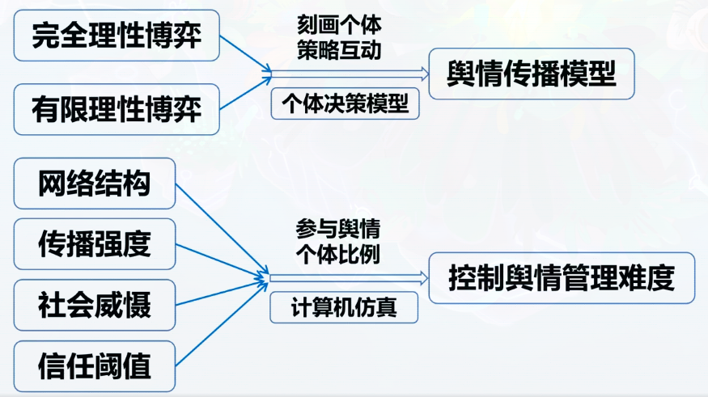

# 1 绪论

## 舆情的含义
在一定社会空间内，较多民众关于社会中各种现象，问题所表达的**信念、态度、意见和情绪等**表现的总和  
> example: 假新闻，造谣信息对社会大众情绪的影响  

## 产生背景
1. 互联网普及率逐渐增高（信息传播的速率增加）  
2. 社会媒介的缺失导致信息无法完全传播（*无标记网络*  ）
3. 网络舆情爆发传播速度远超传统媒体  
4. 传播内容**碎片化，情绪多，事实少，观点片面**（社交媒体每个人都能发声）  
5. 新形态信息交互模式改变了传统媒体  

## 舆情特点
* 直接性（立即表达意见）  
* 突发性（打破空间和时间界限）  
* 随意性，多元化（舆论内容五花八门，内容丰富）  
* 隐蔽性 （发言者身份隐蔽）  
* 偏差性（网舆不能等同全民立场，缺乏自律而产生的不负责任言论）  

## 舆情形成
### 1.舆情的发展  
> *exmaple: 2016.01.22 《江苏女教师监考去世，中学生平静做题》*

> 2016年1月14日，是江苏泰州统考的日子，而在泰兴济川中学，一名三十六岁 的吴姓女教师在监考中死去，等到交卷结束，才被人发现。据报道，吴老师被称作 学校最美音乐老师。然而，令人惊讶的是已经读初中的学生，竟然能在目睹吴老师 最后挣扎呻吟中平静地做完题，*是考试太投入了，太认真了，还是他们太过无知，对眼前发生的一切，看不出其中危险。*  
> **后经校方证实事实**。11时20分考试结束，铃声响起，但初二 (20)班的教室里没有教师收考卷。杨军说，当时吴萍老师坐在教室的最后面，所有学生背对该教师，学生发现监考老师没有站 起来收卷子，便通知了隔壁班上的老师。大家一边紧急施救，一边打120并尽快送往医院。  
> 虽然女教师最终因抢救无效去世，但孩子们当时的表现并不能用“冷血无知”来形容。正如济川中学校长杨军所言，“如果是站着倒下来，学生绝对不可能不闻不问的，他们不知道发生了什么。”  

*舆论产生的意义，警示：凸显的什么问题，需要加强、改进什么*    
* 事件标题：反差感，突出矛盾点吸引眼球（标题党）  
* 没有经过事实调查依据，仅凭个人观点发表言论  

### 2. 舆情的正负面影响  
* **正面**
    * 满足公众知情权
    * 化解谣言，稳定民心
    * 正确舆论导向有利于危机事件解决
    * 对人员行为的监督和约束  

* **负面**  
    * 理性与非理性舆论的同时存在
    * 利用热点，敏感新闻进行炒作
    * 错误消极的舆论造成的谣言会导致社会增加不安定因素
    * 增加政府对社会管理的难度  

## 集群行为（不局限于组织形式）
一群人以某种**共同的兴趣、目的或物质利益取向的个体组成的暂时性集群**（如吃瓜群体）  
这个集群具有直接/间接的交流和心理依附关系  
并且成员之间能够以一定的社会关系为纽带而相互影响  
从而导致他们的行为具有一致性    
> 人群的依附，从众心理  

**如何调控舆情传播中的集群行为**  
关键过程：传播一个事件，社会网络大部分节点个体对传言判断并给出意见，意见相同的群体会暂时集结在一起，**这样的网络是不稳定的**，但这个集体中个体的判断会受到集体的影响  

## 研究目标
* 集群行为背后具体演化机制，一般演化规律（一个事件从开端到各个舆论意见发展的过程）  
* 社会网络中的集群动力学行为  
* **如何控制舆论**（如采取强制性措施）  

## 研究内容

